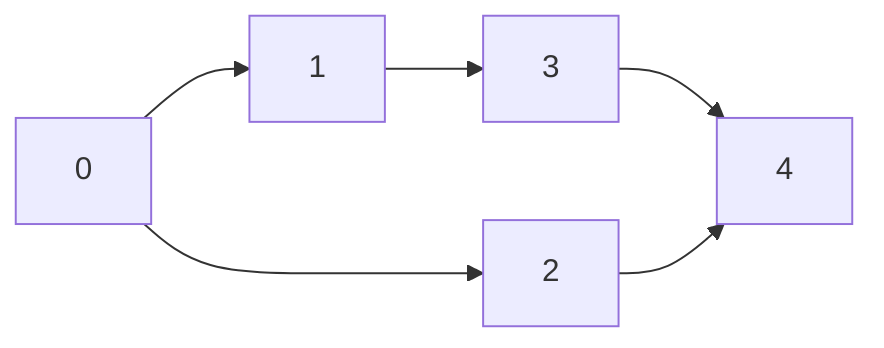
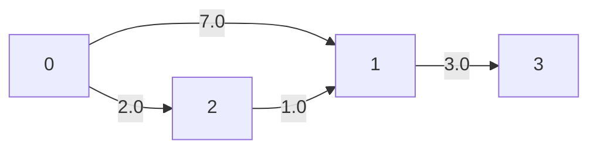
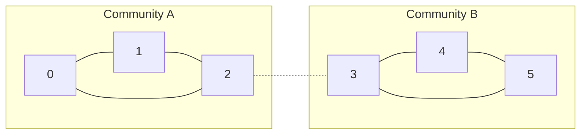

# SparkDB: Complete System Internals, Sparse Matrix Foundations, Data Management & Algorithm Specification

---

## Table of Contents

1. [Sparse Linear Algebra & GraphBLAS Foundations](#1-sparse-linear-algebra--graphblas-foundations)
   * [1.1 Why Matrices for Graphs? Adjacency Matrix vs. Pointer Networks](#11-why-matrices-for-graphs-adjacency-matrix-vs-pointer-networks)
   * [1.2 Sparse Matrix Formats: COO, CSR, and CSC](#12-sparse-matrix-formats-coo-csr-and-csc)
   * [1.3 CPU Cache Locality & Memory Hierarchy Impact](#13-cpu-cache-locality--memory-hierarchy-impact)
   * [1.4 GraphBLAS Semirings in Graph Traversal](#14-graphblas-semirings-in-graph-traversal)
2. [Database Storage Architecture & Data Management](#2-database-storage-architecture--data-management)
   * [2.1 Decoupled Tri-Store Substrate](#21-decoupled-tri-store-substrate)
   * [2.2 Topology Engine: MatrixStore & ID Recycling](#22-topology-engine-matrixstore--id-recycling)
   * [2.3 Property Management: In-Memory vs. Hybrid SQLite WAL](#23-property-management-in-memory-vs-hybrid-sqlite-wal)
   * [2.4 Dense Vector Engine: HNSW & SIMD Fallback](#24-dense-vector-engine-hnsw--simd-fallback)
   * [2.5 Inverted Lexical Engine: FulltextStore & BM25](#25-inverted-lexical-engine-fulltextstore--bm25)
   * [2.6 Durability & State Lifecycle: Snapshotting & AOF Replay](#26-durability--state-lifecycle-snapshotting--aof-replay)
3. [Data Redundancy & Memory Bloat Analysis](#3-data-redundancy--memory-bloat-analysis)
   * [3.1 Topology Redundancy (5-Way Edge Duplication)](#31-topology-redundancy-5-way-edge-duplication)
   * [3.2 Property Storage Redundancy (RAM vs. SQLite Disk)](#32-property-storage-redundancy-ram-vs-sqlite-disk)
   * [3.3 Dense Vector Embedding Redundancy](#33-dense-vector-embedding-redundancy)
   * [3.4 Snapshot Serialization RAM Spikes](#34-snapshot-serialization-ram-spikes)
4. [Comprehensive Algorithm Deep Dive: Math, Code & Step-by-Step Traces](#4-comprehensive-algorithm-deep-dive-math-code--step-by-step-traces)
   * [4.1 PageRank (Power Iteration & Dangling Node Conservation)](#41-pagerank-power-iteration--dangling-node-conservation)
   * [4.2 Unweighted Shortest Path (BFS with CSR Row Slicing)](#42-unweighted-shortest-path-bfs-with-csr-row-slicing)
   * [4.3 Weighted Shortest Path (Dijkstra over Min-Plus Semiring)](#43-weighted-shortest-path-dijkstra-over-min-plus-semiring)
   * [4.4 Degree Centrality (CSR/CSC Matrix Duality)](#44-degree-centrality-csrcsc-matrix-duality)
   * [4.5 Weakly Connected Components (WCC)](#45-weakly-connected-components-wcc)
   * [4.6 Strongly Connected Components (SCC)](#46-strongly-connected-components-scc)
   * [4.7 Label Propagation Algorithm (LPA Community Detection)](#47-label-propagation-algorithm-lpa-community-detection)
   * [4.8 Triangle Counting via Matrix Trace $\frac{1}{6}\text{Trace}(A^3)$](#48-triangle-counting-via-matrix-trace-frac16texttracea3)
   * [4.9 Provenance & Citation Lineage Tracing](#49-provenance--citation-lineage-tracing)
5. [Architectural Loopholes & Next-Step Roadmap](#5-architectural-loopholes--next-step-roadmap)

---

## 1. Sparse Linear Algebra & GraphBLAS Foundations

### 1.1 Why Matrices for Graphs? Adjacency Matrix vs. Pointer Networks

Traditional graph databases (e.g., Neo4j, standard RDF triplestores) utilize **index-free adjacency** based on linked pointers. In pointer networks:
* Each node is a heap object with pointers to incoming and outgoing edge lists.
* Traversing a path requires dereferencing pointers through arbitrary memory locations.
* **The Pointer Flaw**: Pointer dereferences induce constant **L1/L2/L3 CPU cache misses** and Translation Lookaside Buffer (TLB) thrashing. CPUs spend over 80% of execution cycles stalled, waiting for dynamic RAM (DRAM) fetches.

**SparkDB replaces pointer-chasing with Sparse Linear Algebra (GraphBLAS duality)**:
* A graph $G = (V, E)$ with $|V| = N$ nodes is represented as an $N \times N$ adjacency matrix $A$.
* If a directed edge exists from node $i$ to node $j$ with weight $w$, then $A_{ij} = w$.
* **Graph traversal is matrix multiplication**:
  A single-hop traversal from a frontier vector $v$ across relationship matrix $A$ is precisely:
  $$v' = v \cdot A$$
* Multi-hop traversals of length $k$ correspond to matrix powers: $A^k$.
* Finding common neighbors between nodes $u$ and $v$ is the vector dot product of their respective row slices.

---

### 1.2 Sparse Matrix Formats: COO, CSR, and CSC

Real-world graphs are **sparse**: a social network with 10 million users where each user has 100 friends contains $10^7$ nodes and $10^9$ edges. A dense $10^7 \times 10^7$ matrix would require $10^{14}$ cells (400 Terabytes). In contrast, a sparse matrix only stores the non-zero (NNZ) entries.

SparkDB utilizes three primary representations:

```
Dense Matrix (Wasteful)            Sparse Compressed Row (CSR - Efficient)
┌───┬───┬───┬───┐                 indptr : [0, 2, 3, 5, 5]
│ 0 │ 5 │ 8 │ 0 │                 indices: [1, 2, 0, 1, 3]
├───┼───┼───┼───┤                 data   : [5.0, 8.0, 3.0, 2.0, 7.0]
│ 3 │ 0 │ 0 │ 0 │
├───┼───┼───┼───┤                 Memory: 3 compact contiguous arrays
│ 0 │ 2 │ 0 │ 7 │                 Direct CPU SIMD vectorization!
├───┼───┼───┼───┤
│ 0 │ 0 │ 0 │ 0 │
└───┴───┴───┴───┘
```

#### 1. Coordinate Format (COO)
* Storage: Three arrays `(rows, cols, data)`.
* Edge $(u, v, w)$ is stored as `rows[k] = u`, `cols[k] = v`, `data[k] = w`.
* Advantage: Fast append operations ($O(1)$ edge ingestion).
* Disadvantage: Random lookups require scanning arrays ($O(\text{NNZ})$).

#### 2. Compressed Sparse Row (CSR) — Optimized for Outgoing Traversal ($u \to v$)
CSR compresses the row indices into an index pointer array:
* `data`: Non-zero values of length $\text{NNZ}$.
* `indices`: Column index corresponding to each entry in `data` (length $\text{NNZ}$).
* `indptr`: Array of length $N + 1$. `indptr[i]` indicates the starting index in `indices` and `data` for row $i$.
* **Neighbor Lookup**: Finding all targets from source node $u$ requires zero scanning:
  $$\text{Target nodes} = \text{indices}[\text{indptr}[u] : \text{indptr}[u+1]]$$
  $$\text{Edge weights} = \text{data}[\text{indptr}[u] : \text{indptr}[u+1]]$$
  Complexity: **$O(1)$ pointer math** followed by sequential reading of contiguous memory.

#### 3. Compressed Sparse Column (CSC) — Optimized for Incoming Traversal ($v \leftarrow u$)
CSC compresses column indices:
* `indptr[j]` points to the slice of nodes that have directed edges pointing *into* node $j$.
* SparkDB uses CSC to evaluate reverse pattern queries (e.g., `MATCH (a)<-[:FOLLOWS]-(b)`) without transposing matrices at runtime.

---

### 1.3 CPU Cache Locality & Memory Hierarchy Impact

Modern CPU cores operate in sub-nanosecond clock cycles, but fetching data from Main Memory (DRAM) requires 60–100 nanoseconds (~200 CPU cycles):

| Memory Level | Typical Latency | Bandwidth |
| :--- | :--- | :--- |
| **L1 Data Cache** | ~1 ns (4–5 cycles) | ~2 TB/s |
| **L2 Cache** | ~3–4 ns (14 cycles) | ~1 TB/s |
| **L3 Cache (Shared)** | ~10–15 ns (50 cycles) | ~500 GB/s |
| **Main Memory (DRAM)**| ~60–100 ns (200+ cycles) | ~50–100 GB/s |

* **Pointer-chasing Graph Engines**: Every hop jumps to a random memory address in the heap, causing an L1/L2 cache miss and forcing the CPU to stall on DRAM.
* **SparkDB CSR Engine**: Row slices `indices[indptr[u]:indptr[u+1]]` are **32-bit contiguous integer arrays**. When a CPU accesses `indices[indptr[u]]`, hardware prefetchers pull the entire 64-byte CPU cache line, preloading up to 16 adjacent neighbors in a single cycle.

---

### 1.4 GraphBLAS Semirings in Graph Traversal

A **semiring** is an algebraic structure $(D, \oplus, \otimes, 0, 1)$ with addition $\oplus$ and multiplication $\otimes$. By swapping the operations, standard matrix multiplication implements distinct graph operations:

$$\mathbf{C} = \mathbf{A} \oplus.\otimes \mathbf{B} \implies C_{ij} = \bigoplus_{k} \left( A_{ik} \otimes B_{kj} \right)$$

1. **Standard Semiring $(\mathbb{R}, +, \times, 0, 1)$**:
   Calculates the number of paths between nodes or computes transition probabilities (used in **PageRank** and **Random Walks**).
2. **Boolean Semiring $(\mathbb{B}, \lor, \land, \text{False}, \text{True})$**:
   Evaluates pure reachability:
   $$C_{ij} = \bigvee_{k} (A_{ik} \land B_{kj})$$
   Used in SparkDB's `traverse_boolean_step` for unweighted multi-hop BFS.
3. **Tropical / Min-Plus Semiring $(\mathbb{R} \cup \{\infty\}, \min, +, \infty, 0)$**:
   Computes shortest path distances:
   $$C_{ij} = \min_{k} (A_{ik} + B_{kj})$$
   Used in **Dijkstra** and all-pairs shortest paths.

---

## 2. Database Storage Architecture & Data Management

### 2.1 Decoupled Tri-Store Substrate

SparkDB decouples graph workloads into three specialized physical storage engines:

```
                            GraphSpace Engine
                                    │
       ┌────────────────────────────┼────────────────────────────┐
       ▼                            ▼                            ▼
  MatrixStore                  PropertyStore                VectorStore
(Pure Integers &            (Key-Value Attributes &      (Dense Float Vectors &
 Sparse CSR Topologies)     Secondary Indexes)           HNSW Semantic Spaces)
```

1. **MatrixStore**: Contains **no strings, no properties, and no dictionaries**. It strictly tracks integer IDs and CSR/CSC sparse arrays.
2. **PropertyStore**: Manages property attributes for nodes and edges. It operates in pure memory or through a SQLite WAL disk store.
3. **VectorStore**: Manages high-dimensional embeddings and executes nearest-neighbor similarity searches.

---

### 2.2 Topology Engine: MatrixStore & ID Recycling

The `MatrixStore` class ([sparkdb/core/matrix_store.py](file:///C:/Users/ebomven/Experimentation/sparkdb_dev/sparkdb/core/matrix_store.py)) manages node lifetimes and edge connectivity:

* **ID Recycling via Free-List**:
  When a node is deleted, its integer ID is appended to `self._free_node_ids = []`. When `add_node()` is called, it pops from `_free_node_ids` first. This prevents matrix dimensions from growing indefinitely when nodes are repeatedly created and destroyed.
* **Incident Edge Purging**:
  When node $u$ is deleted, all incident edges $(u, v)$ and $(v, u)$ across all relationship types are removed from `_rel_matrices`.
* **Dirty-Flag Matrix Cache Compilation**:
  Edge additions do not recompile CSR arrays immediately. They update `_rel_matrices[rel_type][(src, dst)] = weight` and mark `_dirty_matrices.add(rel_type)`. The CSR/CSC arrays are compiled only when a query requires traversal.

---

### 2.3 Property Management: In-Memory vs. Hybrid SQLite WAL

SparkDB provides two interchangeable property backends:

```
                       Property Management Modes
                                   │
         ┌─────────────────────────┴─────────────────────────┐
         ▼                                                   ▼
In-Memory PropertyStore                            DiskPropertyStore (Hybrid)
• Pure Python Dicts                                • SQLite 3 with WAL Mode
• Inverted Property Indexes                        • Memory-Mapped I/O (2 GB)
• Ultra-low sub-microsecond latency                • LRU OrderedDict Cache
• Bound by physical RAM size                       • Out-of-Core Zero-OOM Scaling
```

#### Hybrid DiskPropertyStore Configuration
Configured in [sparkdb/core/property_store.py](file:///C:/Users/ebomven/Experimentation/sparkdb_dev/sparkdb/core/property_store.py#L201-L232):
* `PRAGMA journal_mode = WAL;`: Write-Ahead Logging allows concurrent readers without blocking writers.
* `PRAGMA synchronous = NORMAL;`: Reduces disk fsync calls while guaranteeing crash resilience.
* `PRAGMA mmap_size = 2147483648;`: Maps up to 2 GB of the SQLite database directly into process virtual memory space.
* `PRAGMA cache_size = -262144;`: Allocates 256 MB of dedicated page cache in RAM.

---

### 2.4 Dense Vector Engine: HNSW & SIMD Fallback

Managed in [sparkdb/core/vector_store.py](file:///C:/Users/ebomven/Experimentation/sparkdb_dev/sparkdb/core/vector_store.py):
* Stores node embeddings of fixed dimensionality $D$ (default 256 or 1536).
* Supports **Cosine Similarity**, **Euclidean Distance ($L_2$)**, and **Inner Product**.
* **Dual Execution Path**:
  * If `hnswlib` is installed: Leverages C++ HNSW graph hierarchy for logarithmic $O(\log N)$ approximate nearest neighbor search.
  * If `hnswlib` is absent: Automatically falls back to NumPy SIMD dot-product matrix multiplication:
    $$\text{scores} = \frac{V \cdot q}{\|V\|_2 \|q\|_2}$$
    ensuring zero installation failures across all operating systems.

---

### 2.5 Inverted Lexical Engine: FulltextStore & BM25

Managed in [sparkdb/core/fulltext_store.py](file:///C:/Users/ebomven/Experimentation/sparkdb_dev/sparkdb/core/fulltext_store.py):
* Tokenizes text properties using regex word splitting, lowercase normalization, and stopword pruning.
* Maintains an inverted index `Dict[str, Dict[int, int]]` mapping `term -> {node_id: term_frequency}`.
* Implements the **Okapi BM25** ranking function:
  $$\text{Score}(D, Q) = \sum_{q \in Q} \text{IDF}(q) \cdot \frac{f(q, D) \cdot (k_1 + 1)}{f(q, D) + k_1 \cdot \left(1 - b + b \cdot \frac{|D|}{\text{avgdl}}\right)}$$
  with standard parameters $k_1 = 1.5$ and $b = 0.75$.

---

### 2.6 Durability & State Lifecycle: Snapshotting & AOF Replay

Durability is orchestrated by `PersistenceEngine` ([sparkdb/core/persistence.py](file:///C:/Users/ebomven/Experimentation/sparkdb_dev/sparkdb/core/persistence.py)):

```
Mutation Request ──► Write to MatrixStore & PropertyStore
        │
        └──► Append JSON record to mutations.aof (and flush)

Periodic Checkpoint ──► Dump full state to snap_tmp.json
        │
        ├──► Atomic rename: snap_tmp.json ──► snapshot.json
        │
        └──► Truncate mutations.aof to 0 bytes
```

* **Crash Recovery Process**:
  1. Engine checks for `snapshot.json`. If present, reads all nodes, edges, properties, and vectors.
  2. Engine inspects `mutations.aof`. Reads each JSON line representing mutations since the last snapshot.
  3. Replays mutations idempotently, restoring the database to the exact state of the last transaction.

---

## 3. Data Redundancy & Memory Bloat Analysis

An architectural audit of SparkDB reveals multiple layers of data duplication:

### 3.1 Topology Redundancy (5-Way Edge Duplication)
For each relationship type `rel_type`, the same edge $(u, v, w)$ is currently stored in up to **5 separate structures**:
1. `_rel_matrices[rel_type][(u, v)] = w` (Python dictionary of coordinate tuples).
2. `_csr_cache[rel_type]` (SciPy CSR: `data`, `indices`, `indptr` arrays).
3. `_csc_cache[rel_type]` (SciPy CSC: transposed column index pointers).
4. `_rev_csr_cache[rel_type]` (Transposed CSR matrix).
5. `_unified_csr` (Consolidated CSR matrix of all relationship types).

**Impact**: In a graph with 50 million edges, storing the topology across 5 redundant structures consumes up to 5x more RAM than necessary.

---

### 3.2 Property Storage Redundancy (RAM vs. SQLite Disk)
In `DiskPropertyStore`:
1. Properties are stored as JSON strings in the SQLite table `node_properties`.
2. Property values are parsed and kept in Python memory inside `self._node_lru` (`OrderedDict`).
3. Property key-value pairs are stored again in the SQLite table `property_index(prop_key, prop_val, node_id)`.
4. **Stale Index Duplication**: When properties are updated, the old index values are never pruned from `property_index`, causing continuous index table bloat.

---

### 3.3 Dense Vector Embedding Redundancy
In `VectorStore`:
1. Dense vectors are stored in memory in `self._vectors[node_id] = np.ndarray`.
2. The exact same vectors are passed into `hnswlib.Index`, which creates internal C++ memory representations.
3. If 1,000,000 nodes each have a 1536-dimensional float32 embedding (6 KB each):
   * `self._vectors` consumes ~6 GB RAM.
   * `hnswlib` consumes ~6 GB RAM + ~3 GB HNSW graph index.
   * Total: ~15 GB RAM used for a 6 GB dataset.

---

### 3.4 Snapshot Serialization RAM Spikes
In `GraphSpace.to_dict()`:
* To create a snapshot, SparkDB pulls the entire graph into a single Python dictionary in RAM (`nodes_data` list + `edges_data` list).
* On a graph consuming 10 GB of database memory, building this dictionary requires allocating another 15–20 GB of transient RAM, which can trigger system OOM kills.

---

## 4. Comprehensive Algorithm Deep Dive: Math, Code & Step-by-Step Traces

---

### 4.1 PageRank (Power Iteration & Dangling Node Conservation)
* **Source Location**: [sparkdb/algorithms/centrality.py:19-70](file:///C:/Users/ebomven/Experimentation/sparkdb_dev/sparkdb/algorithms/centrality.py#L19-L70)
* **Goal**: Measure structural importance based on link authority.

#### Mathematical Foundation
$$r^{(t+1)} = d \cdot \left( P^T r^{(t)} + \frac{\sum_{k \in \text{dangling}} r_k^{(t)}}{N} \mathbf{1} \right) + \frac{1 - d}{N} \mathbf{1}$$
* $d = 0.85$ (damping factor).
* $N$: total node count.
* $P_{ij} = \frac{A_{ij}}{\text{out\_degree}(i)}$: row-stochastic transition matrix.
* Dangling nodes (out-degree = 0) do not pass rank forward; their mass is conserved by distributing it uniformly across all $N$ nodes.

#### Code Mechanics
```python
# Compute out-degree using CSR index pointer difference
deg = np.diff(combined.indptr).astype(np.float32)
is_dangling = (deg == 0)
dangling_idx = np.flatnonzero(is_dangling)
safe_deg = np.where(is_dangling, 1.0, deg)

# Row-normalize into stochastic transition matrix P, then transpose to P^T
scale = np.repeat(1.0 / safe_deg, deg.astype(int))
scaled_data = combined.data * scale
p_matrix = sp.csr_matrix((scaled_data, combined.indices, combined.indptr), shape=(n, n)).transpose().tocsr()

# Power iteration loop
for _ in range(max_iter):
    dang = rank[dangling_idx].sum() if has_dangling else 0.0
    next_rank = damping * (p_matrix.dot(rank) + dang / n) + teleport
    if np.abs(next_rank - rank).sum() < tol:
        break
    rank = next_rank
```

#### Step-by-Step Execution Trace

```
Graph: Node 0 ──► Node 1 ──► Node 2 (Dangling)
N = 3, d = 0.85, teleport = (1 - 0.85) / 3 = 0.05
```

```mermaid
flowchart LR
    0((0)) --> 1((1)) --> 2((2 [Dangling]))
```

* **Iteration 0 ($t = 0$)**:
  Initial uniform distribution:
  $$r^{(0)} = \begin{bmatrix} 1/3 \\ 1/3 \\ 1/3 \end{bmatrix} = \begin{bmatrix} 0.3333 \\ 0.3333 \\ 0.3333 \end{bmatrix}$$
  Out-degrees: $\text{deg}(0) = 1, \text{deg}(1) = 1, \text{deg}(2) = 0$.
  Dangling index: `[2]`.

* **Iteration 1 ($t = 1$)**:
  * Dangling sum: $r_2^{(0)} = 0.3333$.
  * Redistribution per node: $\frac{0.3333}{3} = 0.1111$.
  * Incoming link flow ($P^T r^{(0)}$):
    * Node 0: $0$ (no incoming edges)
    * Node 1: $1.0 \times r_0^{(0)} = 0.3333$
    * Node 2: $1.0 \times r_1^{(0)} = 0.3333$
  * New ranks:
    * $r_0^{(1)} = 0.85 \cdot (0 + 0.1111) + 0.05 = \mathbf{0.1444}$
    * $r_1^{(1)} = 0.85 \cdot (0.3333 + 0.1111) + 0.05 = \mathbf{0.4277}$
    * $r_2^{(1)} = 0.85 \cdot (0.3333 + 0.1111) + 0.05 = \mathbf{0.4277}$
  * $L_1$ delta: $|0.1444 - 0.3333| + |0.4277 - 0.3333| + |0.4277 - 0.3333| = 0.3777 > 10^{-6}$.

* **Iteration 2 ($t = 2$)**:
  * Dangling sum: $r_2^{(1)} = 0.4277$.
  * Redistribution per node: $\frac{0.4277}{3} = 0.1426$.
  * Incoming link flow:
    * Node 0: $0$
    * Node 1: $1.0 \times r_0^{(1)} = 0.1444$
    * Node 2: $1.0 \times r_1^{(1)} = 0.4277$
  * New ranks:
    * $r_0^{(2)} = 0.85 \cdot (0 + 0.1426) + 0.05 = \mathbf{0.1712}$
    * $r_1^{(2)} = 0.85 \cdot (0.1444 + 0.1426) + 0.05 = \mathbf{0.2939}$
    * $r_2^{(2)} = 0.85 \cdot (0.4277 + 0.1426) + 0.05 = \mathbf{0.5348}$

* **Convergence**: Node 2 receives the highest PageRank score because all network flow converges into it.

---

### 4.2 Unweighted Shortest Path (BFS with CSR Row Slicing)
* **Source Location**: [sparkdb/algorithms/pathfinding.py:66-123](file:///C:/Users/ebomven/Experimentation/sparkdb_dev/sparkdb/algorithms/pathfinding.py#L66-L123)
* **Goal**: Find minimum-hop directed path from `source_id` to `target_id`.

#### Code Mechanics
```python
visited = {source_id}
queue = collections.deque([source_id])
parent = {source_id: None}

while queue:
    curr = queue.popleft()
    for csr in csrs:
        r_start = csr.indptr[curr]
        r_end = csr.indptr[curr + 1]
        for nbr in csr.indices[r_start:r_end]:
            nbr = int(nbr)
            if nbr not in visited:
                visited.add(nbr)
                parent[nbr] = curr
                if nbr == target_id:
                    # Early termination
                    return reconstruct_path(parent, target_id)
                queue.append(nbr)
```

#### Step-by-Step Execution Trace

```
Graph:
Node 0 ──► Node 1 ──► Node 3 ──► Node 4
  │                                ▲
  └──────► Node 2 ─────────────────┘
Query: shortest_path(source=0, target=4)
```



1. **Initialization**: `visited = {0}`, `queue = [0]`, `parent = {0: None}`.
2. **Pop 0**: Slices CSR row 0 $\implies$ neighbors `[1, 2]`.
   * Node 1: `visited = {0, 1}`, `parent[1] = 0`, `queue = [1]`.
   * Node 2: `visited = {0, 1, 2}`, `parent[2] = 0`, `queue = [1, 2]`.
3. **Pop 1**: Slices CSR row 1 $\implies$ neighbor `[3]`.
   * Node 3: `visited = {0, 1, 2, 3}`, `parent[3] = 1`, `queue = [2, 3]`.
4. **Pop 2**: Slices CSR row 2 $\implies$ neighbor `[4]`.
   * Node 4 is **target**! `parent[4] = 2`.
   * **Immediate Early Exit Triggered!** (Loop breaks; Node 3 is never expanded).
5. **Path Reconstruction**:
   * Trace parents: $4 \to \text{parent}[4]=2 \to \text{parent}[2]=0 \to \text{parent}[0]=\text{None}$.
   * Reverse path: $\mathbf{[0, 2, 4]}$ (Path length: 2 hops).

---

### 4.3 Weighted Shortest Path (Dijkstra over Min-Plus Semiring)
* **Source Location**: [sparkdb/algorithms/pathfinding.py:125-180](file:///C:/Users/ebomven/Experimentation/sparkdb_dev/sparkdb/algorithms/pathfinding.py#L125-L180)
* **Goal**: Find minimal weight path using priority queue (`heapq`).

#### Step-by-Step Execution Trace

```
Graph with Edge Weights:
0 ──(weight=7.0)──► 1
0 ──(weight=2.0)──► 2
2 ──(weight=1.0)──► 1
1 ──(weight=3.0)──► 3
Query: dijkstra_shortest_path(source=0, target=3)
```



1. **Initialization**: `distances = {0: 0.0}`, `pq = [(0.0, 0)]`, `parent = {0: None}`.
2. **Pop `(0.0, 0)`**:
   * Edge $(0 \to 1, w=7.0) \implies \text{dist} = 0 + 7.0 = 7.0 < \infty$. `distances[1] = 7.0`, `parent[1] = 0`, push `(7.0, 1)`.
   * Edge $(0 \to 2, w=2.0) \implies \text{dist} = 0 + 2.0 = 2.0 < \infty$. `distances[2] = 2.0`, `parent[2] = 0`, push `(2.0, 2)`.
   * PQ state: `[(2.0, 2), (7.0, 1)]`.
3. **Pop `(2.0, 2)`**:
   * Edge $(2 \to 1, w=1.0) \implies \text{new\_dist} = 2.0 + 1.0 = 3.0$.
   * Check relaxation: $3.0 < \text{distances}[1] (7.0) \implies$ **Update!**
   * `distances[1] = 3.0`, `parent[1] = 2`, push `(3.0, 1)`.
   * PQ state: `[(3.0, 1), (7.0, 1)]`.
4. **Pop `(3.0, 1)`**:
   * Edge $(1 \to 3, w=3.0) \implies \text{new\_dist} = 3.0 + 3.0 = 6.0$.
   * `distances[3] = 6.0`, `parent[3] = 1`, push `(6.0, 3)`.
   * PQ state: `[(6.0, 3), (7.0, 1)]`.
5. **Pop `(6.0, 3)`**: Target 3 reached!
6. **Result**: Path: $\mathbf{[0, 2, 1, 3]}$, Total Distance: $\mathbf{6.0}$.

---

### 4.4 Degree Centrality (CSR/CSC Matrix Duality)
* **Source Location**: [sparkdb/algorithms/centrality.py:73-97](file:///C:/Users/ebomven/Experimentation/sparkdb_dev/sparkdb/algorithms/centrality.py#L73-L97)
* **Concept**:
  * **Out-Degree**: Evaluated in $O(1)$ from CSR row pointers:
    $$\text{OutDegree}(i) = \text{CSR.indptr}[i+1] - \text{CSR.indptr}[i]$$
  * **In-Degree**: Evaluated in $O(1)$ from CSC column pointers:
    $$\text{InDegree}(j) = \text{CSC.indptr}[j+1] - \text{CSC.indptr}[j]$$

#### Trace Example
```
Edges: 0 ──► 1, 0 ──► 2, 1 ──► 2, 2 ──► 0
```
* Adjacency Matrix:
  $$A = \begin{bmatrix}
  0 & 1 & 1 \\
  0 & 0 & 1 \\
  1 & 0 & 0
  \end{bmatrix}$$
* CSR `indptr`: `[0, 2, 3, 4]`.
  `np.diff(indptr) = [2, 1, 1] \implies \text{Out-degrees: } \{0: 2, 1: 1, 2: 1\}`.
* CSC `indptr`: `[0, 1, 2, 4]`.
  `np.diff(indptr) = [1, 1, 2] \implies \text{In-degrees: } \{0: 1, 1: 1, 2: 2\}`.

---

### 4.5 Weakly Connected Components (WCC)
* **Source Location**: [sparkdb/algorithms/community.py:20-39](file:///C:/Users/ebomven/Experimentation/sparkdb_dev/sparkdb/algorithms/community.py#L20-L39)
* **Mathematical Concept**: Symmetrizes directed adjacency matrix into an undirected graph:
  $$S = A + A^T$$
  Executes breadth-first traversal across $S$ to partition nodes into disjoint connected components.

#### Trace Example
* Edges: $0 \to 1$, $2 \to 3$.
* Symmetrized graph connects $\{0, 1\}$ into Component 0, and $\{2, 3\}$ into Component 1.
* Result: `{0: 0, 1: 0, 2: 1, 3: 1}`.

---

### 4.6 Strongly Connected Components (SCC)
* **Source Location**: [sparkdb/algorithms/community.py:41-59](file:///C:/Users/ebomven/Experimentation/sparkdb_dev/sparkdb/algorithms/community.py#L41-L59)
* **Mathematical Concept**: Identifies maximal subgraphs where every vertex is mutually reachable from every other vertex along directed edges (Tarjan's algorithm with low-link values).

#### Trace Example
* Cycle: $0 \to 1 \to 2 \to 0$
* Unidirectional Edge: $2 \to 3$
* Result:
  * Subgraph $\{0, 1, 2\}$ forms a directed cycle $\implies$ **Component 0**.
  * Node 3 has no path back to $\{0, 1, 2\} \implies$ **Component 1**.
  * Final: `{0: 0, 1: 0, 2: 0, 3: 1}`.

---

### 4.7 Label Propagation Algorithm (LPA Community Detection)
* **Source Location**: [sparkdb/algorithms/community.py:61-105](file:///C:/Users/ebomven/Experimentation/sparkdb_dev/sparkdb/algorithms/community.py#L61-L105)
* **Concept**: Semi-synchronous iterative community detection. Every node adopts the majority community label of its neighbors.

#### Trace Example

```
Two Dense Triangles connected by a bridge edge (2-3):
Triangle A: Nodes {0, 1, 2}
Triangle B: Nodes {3, 4, 5}
Bridge: 2 ── 3
```



1. **Initialization**: `labels = [0, 1, 2, 3, 4, 5]`.
2. **Iteration 1**:
   * Intra-cluster edges outvote the single bridge edge $2-3$.
   * Nodes 0, 1, 2 adopt label `0`.
   * Nodes 3, 4, 5 adopt label `3`.
3. **Iteration 2**:
   * Node 2 votes: Neighbors $\{0, 1\}$ have label 0 (weight 2). Neighbor 3 has label 3 (weight 1). Label 0 wins.
   * Node 3 votes: Neighbors $\{4, 5\}$ have label 3 (weight 2). Neighbor 2 has label 0 (weight 1). Label 3 wins.
4. **Convergence**: No labels change. Partition output:
   * Community 0: `{0, 1, 2}`
   * Community 3: `{3, 4, 5}`

---

### 4.8 Triangle Counting via Matrix Trace $\frac{1}{6}\text{Trace}(A^3)$
* **Source Location**: [sparkdb/algorithms/structural.py:12-32](file:///C:/Users/ebomven/Experimentation/sparkdb_dev/sparkdb/algorithms/structural.py#L12-L32)
* **Mathematical Theorem**:
  In an undirected simple graph (no self-loops), closed walks of length 3 starting and ending at node $i$ equal $(A^3)_{ii}$.
  Each triangle $\{u, v, w\}$ produces 6 closed walks:
  * $u \to v \to w \to u$ and $u \to w \to v \to u$
  * $v \to w \to u \to v$ and $v \to u \to w \to v$
  * $w \to u \to v \to w$ and $w \to v \to u \to w$
  $$\text{Triangles} = \frac{1}{6} \text{Trace}(A^3)$$

#### Optimization via Hadamard Product
Computing $A^3$ directly requires two dense matrix multiplications ($O(N^3)$). SparkDB uses:
$$\text{Trace}(A^3) = \text{Trace}(A \cdot A^2) = \sum_{i,j} A_{ij} (A^2)_{ij} = \sum (A \odot A^2)$$
where $\odot$ is the element-wise Hadamard product.

#### Code Mechanics
```python
adj = ((combined + combined.transpose()) > 0).astype(np.float32)
adj.setdiag(0)
adj.eliminate_zeros()

a2 = adj.dot(adj)                  # A^2 via sparse matrix multiplication
trace_a3 = adj.multiply(a2).sum()  # Hadamard product A ⊙ A^2 and sum
return int(round(trace_a3 / 6.0))
```

#### Trace Example
Triangle $K_3$ (Nodes 0, 1, 2 all connected):
$$A = \begin{bmatrix} 0 & 1 & 1 \\ 1 & 0 & 1 \\ 1 & 1 & 0 \end{bmatrix}, \quad
A^2 = \begin{bmatrix} 2 & 1 & 1 \\ 1 & 2 & 1 \\ 1 & 1 & 2 \end{bmatrix}$$
$$A \odot A^2 = \begin{bmatrix} 0\cdot 2 & 1\cdot 1 & 1\cdot 1 \\ 1\cdot 1 & 0\cdot 2 & 1\cdot 1 \\ 1\cdot 1 & 1\cdot 1 & 0\cdot 2 \end{bmatrix} = \begin{bmatrix} 0 & 1 & 1 \\ 1 & 0 & 1 \\ 1 & 1 & 0 \end{bmatrix}$$
$$\sum (A \odot A^2) = 6 \implies \text{Triangles} = \frac{6}{6} = \mathbf{1}$$

---

### 4.9 Provenance & Citation Lineage Tracing
* **Source Location**: [sparkdb/algorithms/provenance.py:7-25](file:///C:/Users/ebomven/Experimentation/sparkdb_dev/sparkdb/algorithms/provenance.py#L7-L25)
* **Application**: Real-time RAG and Knowledge Graph lineage.
* **Mechanism**:
  Given an entity node ID, it queries the CSR matrix for relationship `MENTIONED_IN`:
  ```python
  r_start = csr.indptr[entity_node_id]
  r_end = csr.indptr[entity_node_id + 1]
  chunk_ids = csr.indices[r_start:r_end]
  ```
  Returns source text chunks, document origins, and offsets in $O(k)$ time without scanning tables.

---

## 5. Architectural Loopholes & Next-Step Roadmap

All issues identified across data integrity, security, concurrency, memory bloat, and query execution have been cataloged in [issues.md](file:///C:/Users/ebomven/Experimentation/sparkdb_dev/issues.md) with complete root cause analysis and code implementations ready to resolve in one execution.
